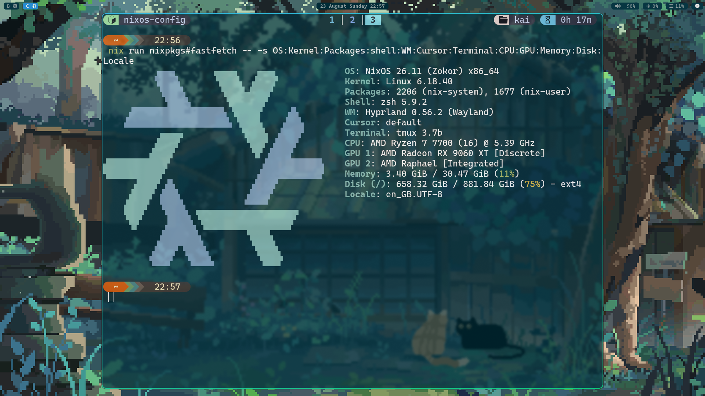
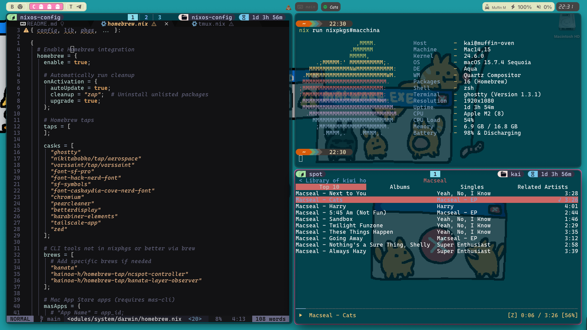

# Nix Config

My Nix flake, using Home Manager to manage a NixOS desktop, macOS laptop, and NixOS-WSL environment.

| Host | Platform |
| --- | --- |
| `nix-muffin` | NixOS desktop |
| `macbook` | macOS with nix-darwin |
| `wsl-host` | NixOS-WSL |

## Structure

- `hosts/` contains the host-specific system and Home Manager configurations.
- `modules/` contains shared system and home modules.
- `packages/neovim/` contains the standalone Neovim package.
- Other folders are respective app specific configurations

## Standalone Neovim Derivation

The Neovim configuration is packaged independently with [nix-wrapper-modules](https://github.com/BirdeeHub/nix-wrapper-modules) and can be run without using the rest of this config:

```sh
nix run github:Kainoa-h/nix#nvim
```

## Hosts

### nix-muffin

- Window Manager: [Hyprland](https://github.com/hyprwm/hyprland) + [Waybar](https://github.com/alexays/waybar)
- Launcher: [Elephant](https://github.com/abenz1267/elephant) + [Walker](https://github.com/abenz1267/walker)
- Wallpaper: [DecomposedMaw](https://ko-fi.com/s/44c7d66479)

### macbook

- Window Manager: [Aerospace](https://github.com/nikitabobko/AeroSpace) + [SketchyBar](https://github.com/FelixKratz/SketchyBar)
- Launcher: [Vorssaint](https://github.com/vorssaint/vorssaint-utils)
- Wallpaper: [Catino](https://www.patreon.com/catinoworld/posts/catinoxp-124641128)
